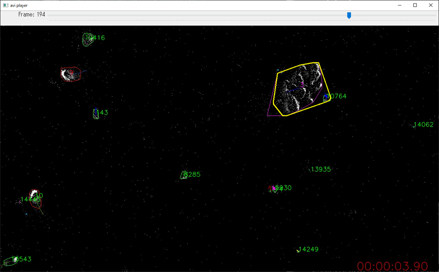

# Tutorial

This is a tutorial about how to use the Python scripts with the sample data contained in the "data" folder.


___
## evs2cluster.py

#### Cluster analysis

1. Open a Command Prompt window and move to the folder where "evs2cluster.py" is stored.
1. Execute "evs2cluster.py".
<br>
1. At the top of the application window (A), select a folder containing files for cluster analysis.
<br>
1. At the left of the window (B), select a target .raw file, which is "plankton_sample.raw" in this example.
1. Set parameters for subclustering process (C), leave them to the default values in this example.
<br>\* Explanation of "NEIGHBOUR_TH" variable:
Default value is 1 and it has to be an integer value.
A new event is processed as a valid event if it has "NEIGHBOUR_TH" or more number of recent events in its neighbouring pixels, otherwise the event will be discarded.
Thus, larger value of "NEIGHBOUR_TH" results in smaller number of valid events and shorter process time.
If EVS data is too noisy, consider increasing "NEIGHBOUR_TH" to filter out noise.

1. Make sure that "plankton_sample.raw" is highlighted in the left panel (B).
Then click "Run all" button (D) to launch all processes consisting of subclustering, clustering, analysis and video generation.
1. If "Output \*_sub.avi" checkbox is ON, a window will appear and show how subclustering process is going on.
The analysis results are not affected by the checkbox status.
<br>
1. When all processes are finished, "Progress monitor" shows at what time the program has finished.
In this example all the processes shouldn't take more than a few minutes.
<br>
1. The cluster analysis results are now stored in "plankton_sample_analysis1" folder.
<br>\* The last serial number of the folder name increments as you repeat from the subclustering process.
<br>
<br>\* If you edit "config.py" and have both "FLG_CALC_FEATURES" and "ENABLE_FFT" set to "1", FFT analysis results will be saved in "fig" folder under the analysis folder.
The red arrowhead shows a detected peak and the summary of all the detected peaks will be saved as "fft_peaks.txt" in the same folder as "evs2video.py".
<br>
1. The .avi file named "data_plankton_sample_th1_00h00m00sTo00h00m05s.avi" shows video images of how "plankton_sample.raw" was converted into clusters.
"\*.pkl" and "\*.sub" files are byproducts of the program and can be used for further processes later, so make sure not to delete them.
<br>\* Clusters are surrounded by lines of different colors, depending on the classification inference results by machine learning.
The machine learning process is described in "Machine learning" clause below.
<br>
<br>
1. You can terminate the application by closing the application window.
A couple of error messages will probably show up in the Command Prompt window but they will not affect the cluster analysis results.
In case the application or the Command Prompt window stops responding and you want to terminate the application immediately, please kill the process by Task Manager.

<br>
<br>

#### Manual merging of clusters

Because automatic cluster analysis does not always work correctly, the application provides you with a method to manually merge clusters.
<br>\* Before manually merging clusters, make sure that all processes of cluster analysis have been already finished as described in "Cluster analysis" clause above.

1. Open a Command Prompt window and move to the folder where "evs2cluster.py" is stored.
1. Execute "evs2cluster.py".
1. Click "Modify clusters" button at the bottom to open a sub-window.
1. At the top of the sub-window (A), select an analysis folder containing \*.pkl files, which is "plankton_sample_analysis1" folder in this example.
<br>
1. At the left of the sub-window (B), select a target .pkl file, which is "data_plankton_sample_th1_00h00m00sTo00h00m05s.pkl" in this example.
Then a player window will appear and automatically start playing the corresponding .avi file.
Press Space key of your keyboard to pause the playback and use the track bar (P) at the top to navigate to the frame of interest.
<br>\* The slider of the track bar can be shifted pressing left or right arrow keys of your keyboard.
<br>
1. Let's say you want to merge clusters whose IDs are 3 and 10764,
hover the mouse over one of the clusters and left click.
Text boxes (C,E) of the sub-window will be updated as shown below.
<br>\* If it is difficult to find where cluster 3 is, type "3" in "Find" text box (F) and click "Go" and the cluster will be selected without a left click.
<br>
1. Left click the other cluster and click "Merge" button (G) to execute merging.
Text boxes (D,E) of the sub-window will be cleared to zero.
Now, if you refresh the frame by hitting Space key to restart playing or navigate to a different frame using the track bar, the merged cluster will appear surrounded by thick yellow lines.
<br>\* If you want to undo/redo merging clusters, click "Undo"/"Redo" button (H, I). "Clear" button (J) will erase text boxes (C,D) for selecting clusters.
<br>
1. Click "Overwrite .pkl" button (K) to overwrite "data_plankton_sample_th1_00h00m00sTo00h00m05s.pkl" in this example.
Note that this process cannot be undone, so saving a backup of the .pkl file prior to the process is recommended.
<br>\* The backup of the .pkl should not be saved in the same folder if its filename ends with "\*s.pkl".
1. In order to close the player window, select the player window with a left click and then press 'q' key of your keyboard.
1. Now that clustering results are changed, go back to the main application window
and, with the target you have just updated selected at the left panel,
click "Analysis" and then "Video" buttons at the bottom to overwrite analysis results.
<br>
<br>\* If you play the overwritten .avi file, you can see cluster 10764 has disappeared and has been merged into cluster 3.
<br>

<br>
<br>

#### Annotating clusters

For further process such as machine learning, the application provides you with a method to annotate clusters with text labels.

1. Follow the steps of "Manual merging of clusters" clause until step 5
1. Let's say you want to annotate the cluster whose ID is 9 as "Nfus",
hover the mouse over the cluster and left click.
Text boxes (C,E) of the sub-window will be updated as shown below.
<br>\* If it is difficult to find where cluster 9 is, type "9" in "Find" text box (F) and click "Go" and the cluster will be selected without a left click.
<br>
1. Select one of the annotations from "Select annotation" list box and "Message" text box will tell you the result as below.
<br>\* The contents of the list box are defined in "config.py". You can edit "config.py" according to your demand.
<br>
1. Click "Overwrite .pkl" button (K) to overwrite "data_plankton_sample_th1_00h00m00sTo00h00m05s.pkl" in this example.
Note that this process cannot be undone, so saving a backup of the .pkl file prior to the process is recommended.


___
## cluster2radarChart.py

#### Radar chart

"cluster2radarChart.py" lets you plot the trajectories of clusters within a designated period of time.
<br>\* Before plotting a radar chart, make sure that all processes of cluster analysis have been already finished as described in "Cluster analysis" clause above.

1. Open a Command Prompt window and move to the folder where "cluster2radarChart.py" is stored.
(The folder should be the same as "evs2cluster.py")
1. Execute "cluster2radarChart.py".
1. At the top of the window (A), select an analysis folder containing \*.pkl files, which is "plankton_sample_analysis1" folder in this example.
<br>
1. At the left of the window (B), select a target .pkl file, which is "data_plankton_sample_th1_00h00m00sTo00h00m05s.pkl" in this example.
1. At the bottom of the window (E), click "Load .pkl" button and "Start second" and "End second" (C) will be updated to 0 and 5 respectively.
You can change "Start second" and "End second" to a narrower time range if needed.
1. Let's say you want to highlight the trajectories of clusters whose IDs are 3 and 10,
type "3,10" in the text box at the bottom of the window (D) and click "Draw" button (F).
A window of radar chart will appear and the trajectories of cluster 3 and 10 will be drawn in red lines.
<br>\* Clusters with more than 200 pixels total travel distance will be plotted.
<br>\* If you have multiple .pkl files to plot in one radar chart, repeat steps up to this step.
The application will superpose trajectories from each .pkl file.
<br>
1. Click "Save .png" button (G) to save the radar chart to "radar.png" file in the analysis folder.
<br>\* Below is a magnified view of the "radar.png" image. The blue line results from cluster 9.
<br>
<br>\* As a byproduct, the application creates "var_velocity.csv" in the analysis folder,
whose contents have cluster IDs on the 1st column and the variance of velocity of each cluster at the 2nd column.
Note that "var_velocity.csv" is always written in append mode so you should delete this file prior to the process if it already exists.
<br>


___
## learn.py

#### Machine learning

Based on the predefined 22 features of clusters (saved in "features.csv"), you can train a simple three-layer neural network using "learn.py".
Before learning, you need to annotate clusters and assign some of the clusters to teacher data and the others as test data.
Annotation process is described in "Annotating clusters" clause above.

1. Open a Command Prompt window and move to the folder where "learn.py" is stored.
(The folder should be the same as "evs2cluster.py")
1. Execute "learn.py".
1. At the top of the window (A,B), select two folders containing \*.csv files of teacher data and test data.
, which are "teacher_csv" and "test_csv" folders in this example.
<br>
1. At the left of the window (C,D), select .csv files to be used for learning. In this example all files are selected.
<br>\* These sample .csv files are renamed files of "features.csv".
1. Change the number of epoch (E) if needed.
1. Click "Run" button (F) to start learning and the learning results will be saved in "nn_param" folder, which is under the same folder as "learn.py"
<br>\* As a byproduct, the application creates "learning_curve.csv" in the folder of test data,
1. In order to use the trained neural network to classify new clusters, edit "config.py" and set "FLG_INFERENCE" to "1" as below.
If it is set to "0", classification inference will be skipped.
```python
FLG_INFERENCE = 1
```


___
## evs2video.py

#### Simple conversion to video

"evs2video.py" lets you simply convert .raw files to .avi video files.
This is the quickest way to get the feeling of what were captured in the EVS data.

1. Open a Command Prompt window and move to the folder where "evs2video.py" is stored.
(The folder should be the same as "evs2cluster.py")
1. Execute "evs2video.py".
1. At the top of the application window (A), select a folder containing files to be converted into video.
<br>
1. At the left of the window (B), select a target .raw file, which is "plankton_sample.raw" in this example.
1. "plankton_sample.raw" is 5 seconds long.
Here, let's convert the first 3 seconds and latter 2 seconds separately into two different .avi files.
Type "0,3,5" in "Boarder time list" text box (C).
<br>\* The 3rd value can be 5 or any integer value greater than 5.
1. Make sure that "plankton_sample.raw" is highlighted in the left panel (B).
Then click "Run" button (D) to launch video conversion.
1. The generated two .avi files are saved in "avi" folder under the same folder as "evs2video.py".
